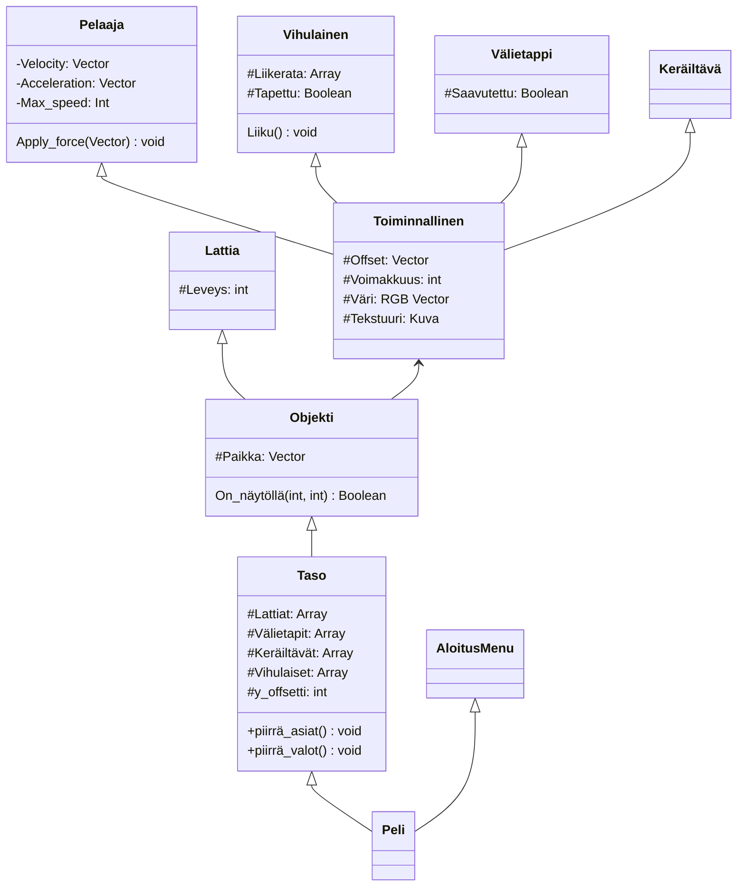

```mermaid
classDiagram
    class Taso {
        #Lattiat: Array
        #Välietapit: Array
        #Keräiltävät: Array
        #Vihulaiset: Array

        #y_offsetti: int

        +piirrä_asiat() void
        +piirrä_valot() void
    }

    class Objekti {
        #Paikka: Vector

        On_näytöllä(int, int) Boolean
    }


    class Toiminnallinen {
        #Offset: Vector
        #Voimakkuus: int
        #Väri: RGB Vector

        #Tekstuuri: Kuva
    }

    class Lattia{
        #Leveys: int
    }

    class Välietappi {
        #Saavutettu: Boolean
    }

    class Vihulainen {
        #Liikerata: Array
        #Tapettu: Boolean

        Liiku() void
    }

    class Pelaaja {
        -Velocity: Vector
        -Acceleration: Vector
        -Max_speed: Int

        Apply_force(Vector) void
    }
    Pelaaja    <|-- Toiminnallinen
    Vihulainen <|-- Toiminnallinen


    Lattia     <|-- Objekti
    Välietappi <|-- Toiminnallinen
    Keräiltävä <|-- Toiminnallinen
    
    Toiminnallinen <-- Objekti
    
    Objekti <|-- Taso


    Taso        <|-- Peli
    AloitusMenu <|-- Peli   
```
