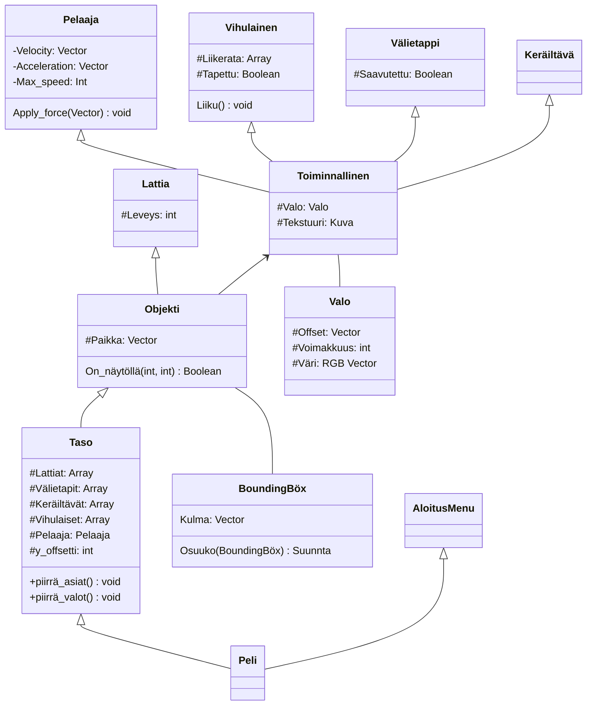

```mermaid
classDiagram
    class Taso {
        #Lattiat: Array
        #Välietapit: Array
        #Keräiltävät: Array
        #Vihulaiset: Array
        #Pelaaja: Pelaaja

        #y_offsetti: int

        +piirrä_asiat() void
        +piirrä_valot() void
    }

    class Objekti {
        #Paikka: Vector

        On_näytöllä(int, int) Boolean
    }


    class Toiminnallinen {
        #Valo: Valo
        #Tekstuuri: Kuva
    }

    class Valo {
        #Offset: Vector
        #Voimakkuus: int
        #Väri: RGB Vector
    }

    class Lattia{
        #Leveys: int
    }

    class Välietappi {
        #Saavutettu: Boolean
    }

    class Vihulainen {
        #Liikerata: Array
        #Tapettu: Boolean

        Liiku() void
    }

    class BoundingBöx {
        Kulma: Vector

        Osuuko(BoundingBöx) Suunnta
    }
    class Pelaaja {
        -Velocity: Vector
        -Acceleration: Vector
        -Max_speed: Int

        Apply_force(Vector) void
    }
    Pelaaja    <|-- Toiminnallinen
    Vihulainen <|-- Toiminnallinen

    Objekti     --  BoundingBöx
    Lattia     <|-- Objekti
    Välietappi <|-- Toiminnallinen
    Keräiltävä <|-- Toiminnallinen
    
    Toiminnallinen <--  Objekti
    Toiminnallinen --   Valo
    Objekti        <|-- Taso

    Taso        <|-- Peli
    AloitusMenu <|-- Peli   
```
